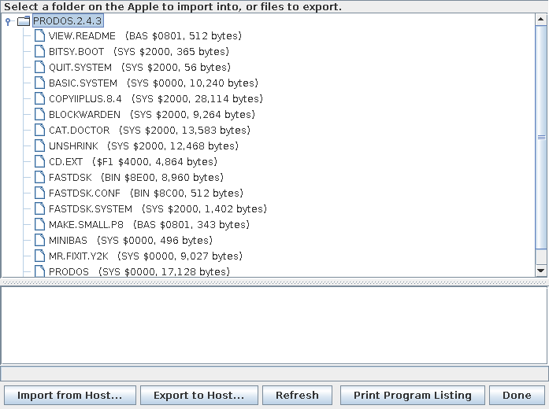
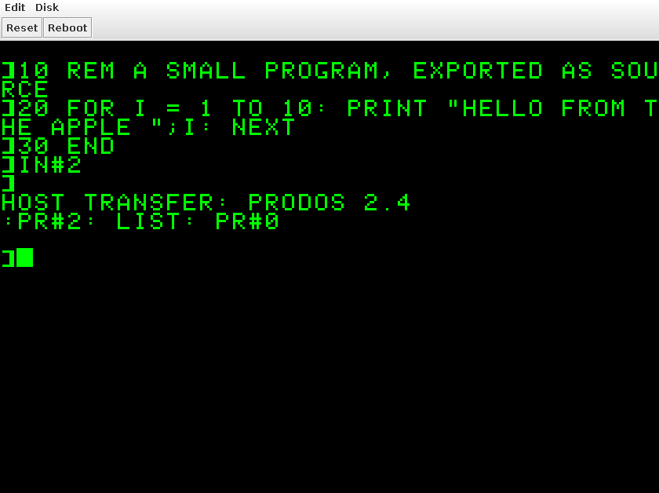

# Host File Transfer Card -- Design

A peripheral card, invented for this emulator, that moves files between
the host and the Apple II's own disks. Not period hardware: this
document is the design, the way HARDWARE-REFERENCE.md records real
cards.

## 1. Principles

- **The guest OS owns its disks.** The emulator never reads or writes a
  file system inside a disk image. Every guest file operation is a real
  call into the guest OS, made by guest code.
- **The emulator knows no guest OS.** It defines an abstract file API
  and drives the whole transfer -- host dialogs, naming, conversions,
  errors -- through it. It never sees an OS call number, a parameter
  list, or a guest memory address.
- **The firmware is an adapter.** The card's firmware implements the
  abstract API for whichever OS is running: ProDOS through its Machine
  Language Interface (MLI), DOS 3.3 through its file manager. Adding an
  OS means adding an adapter, not changing the emulator.
- **The software ships with the card.** Nothing for the user to obtain.
- **Same on every platform**: macOS, Windows, Linux, and Android under
  Termux/PRoot (shared storage at `/sdcard/...`, verified readable and
  writable).

## 2. Configuration

```
[2]
type=hostfiles
```

Any slot 1-7, one card per machine. An optional `dir=` sets the folder
the host dialogs open in first.

## 3. User flow

1. From BASIC, the user types `IN#n` (n = the card's slot). The Apple
   screen shows a one-line status in 40 columns, e.g.
   `HOST TRANSFER: PRODOS 2.4` -- the work happens on the host.
2. The emulator opens a host window: **Import to Apple** or **Export to
   host**.
   - **Import:** the user picks host files with the platform's file
     dialog, then picks the destination on the Apple side -- a ProDOS
     volume and directory, or a DOS 3.3 drive -- from a tree the
     emulator builds by asking the adapter (`VOLUMES`, `LIST`).
   - **Export:** the user picks Apple files from that tree, then a host
     folder.
3. Names are adjusted to the guest's rules (reported by the adapter),
   shown for confirmation, and existing files are replaced only on
   confirmation.
4. The transfer runs; progress and any errors appear in the host
   window.
5. On close, the adapter restores borrowed memory and returns to BASIC
   with normal input and output, as if `PR#0` had been typed.

### 3.1 How a session starts -- within the hardware model

Every step is either the guest running code or the card reacting to its
own registers; the emulator never moves the program counter, writes
guest RAM, or interrupts the guest.

1. **The guest starts it.** `IN#n` (or `CALL` to the card's entry)
   makes the 6502 run the card's ROM through the ordinary slot
   mechanism, as with any real card.
2. **The firmware announces itself.** After detecting the OS, it writes
   "begin session" to the command register, then its `DESCRIBE` reply
   (protocol version, capability record).
3. **The card tells the host side.** That write runs the card's Java
   code on the emulation thread. The card passes the capabilities to a
   `TransferHost` interface it was given at startup and returns at once.
4. **The window opens on the UI thread.** The application's
   `TransferHost` schedules the transfer window with `invokeLater`; the
   emulation thread never waits on the UI.
5. **Requests flow back** through the card's queue, which the firmware
   polls; while the user is in a dialog it simply keeps polling.
6. **The session ends** with `END` or abandonment (5.1); the card tells
   `TransferHost`, which closes or updates the window.

The card never references Swing: it knows only `TransferHost`, wired by
the application as the VideoTerm's views are. Tests supply a scripted
`TransferHost`, so the whole protocol runs headless. With no host UI
present, "begin session" is answered with "not available", and the
firmware prints a message and returns.

Interrupts are deliberately not used to start a session: on a II+ the
interrupt vector belongs to the running software, ProDOS halts on an
interrupt no handler claims, and under DOS 3.3 the vector is whatever
is there. An optional menu item could type `IN#n` through the emulated
keyboard, as Paste does -- faithful, but only useful at a BASIC prompt.



## 4. The abstract API

Defined by the emulator, implemented by each adapter.

### 4.1 Requests

| Request | Arguments | Reply |
|---|---|---|
| `DESCRIBE` | -- | capability record (4.3) |
| `VOLUMES` | -- | list of containers at the top level: volumes or drives |
| `LIST` | container path | entries: name, kind (file or directory), type tag, aux value, attributes, size |
| `READ` | file path | the file's bytes, streamed |
| `WRITE` | file path, type tag, aux value, attributes | creates the file; bytes streamed in |
| `MAKE_DIR` | directory path | -- (only when hierarchical) |
| `DELETE` | file path | -- (to replace an existing file, after confirmation) |
| `END` | -- | restore memory, return to BASIC |

Paths are sequences of name components -- the adapter, not the
emulator, turns them into `/VOL/DIR/FILE` or a DOS drive and name.

### 4.2 Results

`OK`, `NOT_FOUND`, `EXISTS`, `DISK_FULL`, `WRITE_PROTECTED`,
`BAD_NAME`, `IO_ERROR`, or `OTHER` carrying the OS's own error code and
an optional message for display.

The emulator also has to cope with a request that never completes --
see 5.1.

### 4.3 Capability record

What the emulator needs to do its job without knowing the OS.

**Encoding: extensible.** The record is a sequence of tagged,
length-prefixed fields; a reader skips fields it doesn't know. New
fields can therefore be added later -- for an OS not yet supported --
without changing anything that reads the record today. The fields
defined now are the ones ProDOS and DOS 3.3 need; the CP/M column below
is a check that the scheme can grow, not work to do.

| Field | ProDOS | DOS 3.3 | CP/M (future) |
|---|---|---|---|
| display name, version | ProDOS 2.4 | DOS 3.3 | CP/M 2.2 |
| structure | hierarchical | flat, per drive | flat, per drive and user area |
| name rules | 15 chars, letter first, letters/digits/`.`, upper case | 30 chars, most printable characters, upper case | 8 + 3, upper case |
| text line ending | CR | CR | CR LF |
| text high bit | clear | set | clear |
| text end marker | -- | -- | `^Z` |
| size granularity | byte | byte | 128-byte record |
| file types | tag + aux | tag (T/I/A/B/S/R) + load address for B | none |
| attributes | access bits (locked etc.) | locked flag | read-only, system |
| default attributes | unlocked | unlocked | none set |
| *future:* pad byte for partial records | -- | -- | `$1A` |
| *future:* two-part names, forbidden characters | -- | -- | 8 + 3, `< > . , ; : = ? * [ ]` |

Rows are the adapters' declarations, not emulator code: the emulator
only applies whatever a record says. Rows marked *future* are fields
that would be added with an adapter that needs them; under CP/M they
mean an exported binary always comes out a whole number of 128-byte
records -- CP/M doesn't store exact lengths, so none can be preserved.

### 4.4 Types and attributes are opaque

An adapter reports each file's type as a short **tag** and an **aux
value** (e.g. `BIN` and `$2000` under ProDOS, `B` and its load address
under DOS 3.3), and its **attributes** as one opaque byte (e.g.
ProDOS's access bits, DOS 3.3's lock flag). The emulator never
interprets any of them: it encodes them in the host file name on export
and passes them back on import, so round trips are lossless.

**The host naming convention -- settled now, because it outlives every
other choice here** (files already exported must keep importing
faithfully):

```
NAME[#tag,aux[,attr]][.TXT]
```

- `#tag,aux` -- type tag and aux value in hex, e.g. `GAME#BIN,2000`.
- `,attr` -- the attribute byte in hex, present only when it differs
  from the adapter's declared default, e.g. `GAME#BIN,2000,21`.
- `.TXT` -- the file is text, converted for the host. A text file with
  default type and attributes is just `NAME.TXT`.
- Every character used is legal on Windows, macOS and Linux.
- Importing a host file with no type in its name: the adapter's
  declared default for text (if the file is valid text) or binary,
  with default attributes.

### 4.5 Conversions, driven by capabilities

Applied by the emulator, only to files whose tag the adapter marks as
text, and only for sequential files -- random-access text files, whose
records are addressed by byte position, are copied unchanged; the
adapter declares how to recognize them (capability `$0D`):

- line endings: the capability record's, to and from the host's (LF;
  CR LF and lone CR accepted on import);
- high bit: set or clear as the record says;
- *future:* end marker and size granularity, for an OS that needs them.

Everything else is byte-for-byte. Format details inside a file, such
as DOS 3.3's load-address header on B files, are the adapter's
business: the API always carries plain data.

## 5. Transport: the card's registers

CPU-neutral: whichever processor runs the adapter (the 6502 today, a
Z80 under a CP/M card some day) talks to the same registers.

| Offset (`$C0n0`+) | Read | Write |
|---|---|---|
| `$0` | request register: next request opcode, or `0` = none yet | -- |
| `$1` | -- | result register: completes the current request |
| `$2` | data port: next byte from the emulator | data port: next byte to the emulator |
| `$3` | card signature / protocol version | ROM bank select (`$C800`-`$CFFF`) |

- **Requests and replies** are byte streams through the data port:
  strings as a length byte plus characters, numbers little-endian.
- **The adapter polls.** It loops reading the request register; `0`
  means the user is still busy in a host dialog. The emulation thread
  never blocks; requests reach the card from the host UI thread through
  a thread-safe queue.
- **No DMA.** The emulator never touches guest RAM. Everything,
  including file data, crosses the data port. A tight 6502 copy loop
  moves a 64K file in about a second of emulated time.
- **Protocol version.** Register `$3` reads back the card's signature
  and protocol version, and the adapter states the version it speaks in
  its `DESCRIBE` reply; each side uses only what both support.

### 5.1 When the adapter goes away

A request can be left outstanding with no adapter to finish it: the
user presses RESET or Reboot mid-transfer, or (under CP/M 2.2) an OS
reacts to a disk error by ending the running program rather than
returning an error code. The card must never wait forever:

- **RESET:** the card abandons the transfer session at once. This needs
  a small addition to the card interface -- `SlotCard.onReset()`, a
  default no-op, called when the RESET line is asserted (on real
  hardware, the slot connector carries RESET to every card).
- **Reboot:** builds a new machine with a new card, so the session
  ends with the old card.
- **Silence:** if the adapter neither completes the request nor polls
  for 10 seconds, the host window says the Apple stopped responding and
  offers to keep waiting or cancel. Cancel closes the window; the guest
  stays stuck until RESET, which the message suggests.

In each case the host window reports which files completed and which
didn't. The emulator never retries a write on its own: a partly
written file is reported, and the guest OS's own tools decide what
happens to it.

### 5.2 Wire format (protocol version 1)

**Registers** (offset from `$C0n0`):

| Offset | Read | Write |
|---|---|---|
| `$0` | next request opcode; `0` = none yet; `END` whenever no session is open. Reading a request makes its arguments readable on `$2` | -- |
| `$1` | -- | completion code: ends the message the adapter just wrote to `$2` |
| `$2` | next byte of the current request's arguments (or of recalled memory); `0` once exhausted | next byte of the adapter's message |
| `$3` | bits 0-6: protocol version; bit 7: a host transfer window is available | ROM bank select |
| `$4` | -- | the next printed character (`PR#n`, section 7) |
| `$5` | where the firmware has got to in typing a recipe, plus one; 0 = not typing | the same (section 7) |

**Adapter-initiated messages** -- bytes written to `$2`, then the code to `$1`:

| Code | Message | Payload |
|---|---|---|
| `$80` | BEGIN | protocol version spoken (1 byte), then the capability record |
| `$81` | STASH | borrowed memory to keep (opaque, any length) |
| `$82` | RECALL | none; the stashed bytes become readable on `$2` |

**Requests** (card to adapter) and their arguments:

| Opcode | Request | Arguments | Reply payload (with code `$00`) |
|---|---|---|---|
| `$01` | VOLUMES | -- | names, each a string; then an empty string |
| `$02` | LIST | path | entries; then an empty string |
| `$03` | READ | path | a flag byte -- 1 if a type follows: tag, aux -- then the file's bytes |
| `$04` | WRITE | path, tag, aux, attr, size, then `size` data bytes | -- |
| `$05` | MAKE_DIR | path | -- |
| `$06` | DELETE | path | -- |
| `$07` | END | -- | -- (session over) |
| `$08` | PRINT_LISTING | -- | -- (session over; then the adapter prints the BASIC program's listing) |

**Completion codes `$00`-`$7F`** end a request: `$00` OK, `$01`
NOT_FOUND, `$02` EXISTS, `$03` DISK_FULL, `$04` WRITE_PROTECTED, `$05`
BAD_NAME, `$06` IO_ERROR, `$07` OTHER (payload: the OS's own code, 1
byte, then a message string).

**Encodings:** a *string* is a length byte and that many bytes; a
*path* is a count byte and that many strings; *tag* is a string; *aux*
is 2 bytes, *size* 4 bytes, little-endian; *attr* is 1 byte. A list
*entry* is: name (string, never empty), kind, tag, aux, attr, size.
*Kind* is bits: `$01` directory; `$40` size approximate; `$80` aux value
not known until the file is read.

**Adapters read only what a request needs.** A listing reads directory
or catalog structures, nothing inside files. Where that leaves an aux
value unknown -- a DOS 3.3 B file's load address is in its first data
sector -- the entry says so (`$80`), and READ, which reads the file
anyway, sends the type with flag 1. The emulator names an exported file
from READ's type when one comes, else from the listing's.

**Capability record:** fields of tag (1 byte), length (1 byte), value;
ended by tag `$00`. Readers skip unknown tags.

| Tag | Field | Value |
|---|---|---|
| `$01` | OS name | string bytes |
| `$02` | OS version | string bytes |
| `$03` | structure | 0 = flat, 1 = hierarchical |
| `$04` | maximum name length | 1 byte |
| `$05` | name rules | bit 0: upper case only; bit 1: must start with a letter |
| `$06` | allowed non-alphanumeric name characters | the characters |
| `$07` | text line ending | the byte sequence |
| `$08` | text high bit | 0 = clear, 1 = set |
| `$09` | tags that mean text | strings |
| `$0A` | default type for text files | tag (string), aux (2 bytes) |
| `$0B` | default type for other files | tag (string), aux (2 bytes) |
| `$0C` | default attributes | 1 byte |
| `$0D` | text aux is a record length | 1 = a text file with a non-zero aux value is random-access, and is never converted |
| `$0E` | prints the listing | 1 = the adapter handles PRINT_LISTING (the window shows Print Program Listing) |

**Host names** -- the convention of 4.4, plus one rule: characters not
legal in host file names on every platform (`/ \ : * ? " < > |`,
control characters), the convention's own `#` and `%`, and a trailing
space or period are written as `%` and two hex digits, and decoded on
import.

## 6. Firmware (the ProDOS and DOS 3.3 adapters)

**As built (ProDOS adapter, `firmware/hostfiles/hostfiles.s`):**

- **ROM layout:** the `$Cn00` page (entry, the copy routine, finish), then
  expansion ROM bank 0 (detection, borrowing memory, messages) and bank 1
  (the ProDOS agent image). The `$Cn00` page is position-independent: it
  runs at `$C100`-`$C700` depending on the slot. Its first bytes match
  neither the Autostart ROM's disk-boot signature nor Pascal 1.1's.
- **Entry:** `$Cn00` is called as the output device (`PR#n`, with a
  character to print) or the input device (`IN#n`). The firmware saves
  the registers, finds its slot (`JSR $FF58`, the return address's high
  byte) and records it in `MSLOT` (`$07F8`). If `CSW` points at the card
  it prints (section 7); otherwise it touches `$CFFF` and jumps to
  `$C800` to start a session.
- **Borrowed memory, fixed:** `$0800`-`$1BFF` (agent code from `$0800`;
  the ProDOS agent's I/O buffer at `$1000`, data buffer at `$1400`) and
  zero page `$06`-`$09`. Under ProDOS, used only if the bit map marks
  pages `$08`-`$1B` free (under BASIC.SYSTEM they are), otherwise the
  firmware says so.
  Saved to the card before use, restored by the finish routine, from ROM,
  at the end.
- **Code at `$C800` calls nothing but COUT1 (`$FDF0`),** which touches no
  card. All ProDOS calls and all printing during the session come from
  the agent in RAM.
- **Ending: the input vectors, both.** A session runs as the input
  device, so finish returns input to the keyboard: `KSW` (`$38`) and,
  under ProDOS, BASIC.SYSTEM's `VECTIN` (`$BE32`) both back to KEYIN
  (`$FD1B`) -- BASIC.SYSTEM keeps the device in `KSW` as well, and would
  call the card again otherwise -- or under DOS 3.3 `KSW`, then `JSR
  $3EA`. Then it continues into KEYIN with the registers it was called
  with, so input carries on as if the card had never been asked. (Before
  printing existed, sessions ran from `PR#n`, and the same lesson applied
  to `CSW` and `VECTOUT`.)
- **Early exits** print one line and return: no host window, memory in
  use, or neither ProDOS nor DOS 3.3 -- undoing `IN#n` the way the
  running OS needs, as finish does.
- **Verified** under real ProDOS 2.4.3 and BASIC.SYSTEM 1.7 in the
  emulator: every request, multi-chunk files both ways, subdirectories,
  replacing, deleting, attributes (`CATALOG` shows the lock), and a
  BASIC program in the borrowed region surviving the session.

**As built (DOS 3.3 adapter, the same source):**

- **Banks 2-3** hold its image, which is larger than one bank: the copy
  routine follows an image from `$CFFF` on to `$C800` of the next bank
  (reading `$CFFF` releases the ROM, but every fetch from the `$Cn` page
  selects it again). Both agents run at `$0800` and begin with the same
  header -- finish pointer, slot, entry -- so the main code can start
  either. The borrowed region grew to `$0800`-`$1BFF`: agent code up to
  `$15FF`, the DOS agent's buffers above it, the copy's own variables at
  `$1BFB`-`$1BFF`, outside every agent's destination.
- **Containers are drives,** `S6,D1` and so on, for each slot whose ROM
  page carries the Disk II signature. The scan touches `$CFFF` before
  reading each page, so it never leaves two cards selected at once.
- **LIST reads only the catalog,** through RWTS (`$3E3`/`$3D9`,
  documented by Apple): the file manager's CATALOG call only prints, and
  the output device is this card. Sizes are sectors x 256, marked
  approximate; a B file's load address -- in its first data sector -- is
  marked unknown and sent by READ, which reads that sector anyway to strip
  the header. A full System Master lists in about 1.7 seconds (it took 9
  when LIST also read every file's header).
- **READ and WRITE use the file manager** (`$3DC`/`$3D6`) with the
  agent's own buffers, and carry plain data: the adapter strips and adds
  DOS's headers (B: load address and length; A, I: length). Text is read
  to its first `$00`. Locked files get a LOCK call after CLOSE.
- **Facts from *Beneath Apple DOS*, checked:** a WRITE range length is
  one less than the byte count; OPEN with X = 0 answers "file not found"
  even as it creates the file. Chapter 6's OPEN list has types `$08` and
  `$10` swapped -- DOS's own CATALOG code (`$ADE8`, indexing its
  `TIABSRAB` table by bit position) and chapter 4 agree that `$08` is S
  and `$10` is R.
- **Ending:** finish restores output the DOS way when DOS is running --
  `CSW` to `$FDF0`, then `JSR $3EA` -- leaving DOS's hooks exactly as a
  DOS that never saw the card has them, and `PRINT CHR$(4)"CATALOG"`
  still works.
- **Verified** under the real DOS 3.3 System Master: drives, the full
  catalog with load addresses and locks, export (`HELLO#A,0000,80`),
  imports (text stored high-bit with CR; a binary `BLOAD`s and runs),
  replace prompts, lock, delete, errors, a BASIC program surviving, and
  a VideoTerm in slot 3 working before, during and after a session.

**The design as planned:**

- **ROM:** 256 bytes at `$Cn00` (entry, signature) plus banked 2K
  pages at `$C800`-`$CFFF`. Size is not a constraint.
- **OS detection** -- ProDOS first, then DOS 3.3, confirmed against
  real systems booted in the emulator:
  - ProDOS: `$BF00` holds `JMP` (`$4C`), the MLI entry point in the
    system global page (ProDOS 8 Technical Reference, 5.2.4). Observed
    under ProDOS 2.4.3: `$BF00: 4C B7 BF`, `MACHID` (`$BF98`) = `$60`
    (II+, 64K), `KVERSION` (`$BFFF`) = `$24`.
  - DOS 3.3: the page-3 file manager vectors (*Beneath Apple DOS*,
    ch. 5-6). Observed under the DOS 3.3 System Master: `$3D6: 4C FD AA`
    (`JMP` to the file manager) and `$3DC: AD 0F 9D AC 0E 9D 60`
    (`LDA $9D0F / LDY $9D0E / RTS`: parameter-list address, high in A,
    low in Y). DOS occupies `$BF00` with its own code (`D3`), so it never
    looks like ProDOS.
  - Under ProDOS, page 3 can hold anything -- RAM powers up random -- so
    DOS is recognized by the whole `$3DC` routine shape plus the `JMP`
    at `$3D6`, never by a single byte.
  - Neither found: the status line says so and the card does nothing.
- **OS calls run from RAM.** The ProDOS manual states that MLI calls
  cannot be executed from the Language Card area, and while the OS is
  working, other cards' firmware can take over the shared `$C800`
  space. So the adapter copies its working code into RAM and runs it
  there.
- **RAM is borrowed, then restored.** Before starting, the adapter
  streams the RAM it will use -- its working code, the OS's buffers
  (ProDOS: a 1024-byte page-aligned I/O buffer plus a data buffer;
  DOS 3.3: 557 bytes of workarea and sector buffers), and the zero-page
  bytes it needs -- out to the card as an opaque block, and streams it
  back at `END`. Memory, including a BASIC program, is left exactly as
  it was. Under ProDOS the borrowed pages are ones the system memory
  bit map (`$BF58`-`$BF6F`) marks free, read at run time, because
  ProDOS refuses buffers in protected pages.
- **ProDOS calls:** CREATE ($C0), OPEN ($C8), READ ($CA), WRITE ($CB),
  CLOSE ($CC), GET_FILE_INFO ($C4), DESTROY ($C1), ON_LINE ($C5) --
  `JSR $BF00`, call byte, parameter-list pointer; carry set and A = error
  code on failure (Technical Reference, ch. 4).
- **DOS 3.3 calls:** OPEN, READ, WRITE, CLOSE, DELETE, CATALOG via
  `JSR $3DC` / `JSR $3D6`, with the file manager's own error codes
  (*Beneath Apple DOS*, ch. 6). Apple never published this interface,
  but its vectors and parameter-list format are unchanged across DOS
  versions, and Apple's FID uses it.
  - **`LIST` under DOS 3.3 (to confirm when building):** the file
    manager's CATALOG call is expected to print the catalog through the
    output hook rather than return entries, so the adapter would capture
    that output by pointing the hook at its own routine. DOS also counts
    file sizes in sectors, so `LIST` sizes are approximate under DOS
    3.3; exact sizes come from reading the file.

## 7. Printing to the card

**Purpose:** export BASIC program source -- and any other program
output -- as host text, by printing to the card.

**As built:**
- **`PR#n` prints; `IN#n` starts a transfer session.** Printing is what
  `PR#n` means for any card, so it keeps that meaning; the firmware tells
  the two apart the way real cards did, by checking whether the output
  vector (`CSW`) points at it.
- **The print path** is a few instructions in the `$Cn00` page: the
  character goes to register `$4` and nowhere else -- no echo, the screen
  cursor never moves (see below), nothing borrowed -- and every register
  is kept.
- **Jobs:** the card collects printed characters in a spool. It can't see
  `PR#0` -- output simply stops arriving -- so a job ends once printing
  has been idle for 1.5 seconds; then a dialog asks where to save it as a
  host text file. Anything printed meanwhile goes into the next job.
- **Conversion:** clear bit 7, CR to LF. Print output is screen output,
  the same for every OS and BASIC, so no capability record is involved.

**Investigated: what `LIST` actually sends** -- measured by capturing
every byte sent to an output device under DOS 3.3, with lines longer than
40 columns, with and without the screen cursor moving:

| | Applesoft | Integer BASIC |
|---|---|---|
| cursor doesn't move | every line intact, however long | every line intact, however long |
| cursor moves (echo) | breaks past column 33, mid-string; the indent is a cursor move, so the text gets a bare break | breaks near column 38 and prints real spaces to indent, putting spaces inside string literals |
| line format | `10  PRINT ...`: two spaces after the number, spaces around keywords | `   10 PRINT ...`: number right-aligned in 5, statements as typed |
| characters | bit 7 set, CR line ends | bit 7 set, CR line ends |

Hence the rule above: never move the cursor while printing.

**Investigated: how to print exactly the listing.** Everything sent while
output points at the card is captured, so `PR#2`, `LIST`, `PR#0` typed
separately also capture the prompt and the echoed commands -- and those
lines make EXEC fail to rebuild the program. Typed at the prompt, both
DOS 3.3 and BASIC.SYSTEM take a line beginning with `PR#` as their own
command, which can't share the line; ProDOS ignores `CHR$(4)` commands
typed in immediate mode; Integer BASIC has no `CHR$`, and accepts `LIST`
after a colon only inside a program. What works, verified under the real
systems:

| | Print exactly the source |
|---|---|
| Applesoft (ProDOS or DOS 3.3) | `:PR#2: LIST: PR#0` -- the leading colon passes the line to Applesoft, whose own `PR#` redirects output for exactly that line |
| Integer BASIC (DOS 3.3) | `0 PRINT "`*Ctrl-D*`PR#2": LIST 1,32767: PRINT "`*Ctrl-D*`PR#0": END`, then `RUN`, then `DEL 0,0` |

**Print Program Listing: the card types it.** The transfer window's Print
Program Listing button (shown when the adapter declares capability
`$0E`) sends PRINT_LISTING. The adapter ends the session, but instead of
giving input back to the keyboard it stays the input device and *types*
the recipe: on each keyboard read the firmware returns the next
character, exactly as a real input card supplies typing. Choosing the
recipe is BASIC knowledge, so the adapter does it, from the Monitor's
prompt character at `$33` (verified: `]` Applesoft under both OSes, `>`
Integer BASIC, `*` the Monitor -- anything but `]` or `>` types nothing).
The recipe's `PR#n` uses the card's own slot. When the recipe ends, the
firmware restores the input vectors and resumes waiting for a key.

- **Its state lives on the card** -- register `$5`, the place in the
  recipe -- not in the slot's screen-hole scratch byte: Apple II RAM
  powers up random, so a RAM flag would often read "typing" after a cold
  start. The card's register is 0 at power-on and cleared by RESET.
- **The cursor:** the Monitor's RDKEY flashes the cursor before calling
  the input device, and expects the original character put back. The
  firmware puts it back at once when a session starts (before printing
  anything), and when input resumes it flashes the cursor where it is
  *now*, as RDKEY does, before continuing into KEYIN.



**Loading source back:** import the file as a text file through `IN#n`,
then `NEW` and `EXEC` it -- DOS 3.3 and BASIC.SYSTEM both read it as if
typed. The round trip rebuilds an identical program: verified for
Applesoft under ProDOS and Integer BASIC under DOS 3.3
(`PrintIntegrationTest`). The export is each BASIC's own rendering of the
stored program, not the original keystrokes; typed back in, it rebuilds
the same program.

**Later, separately:** an emulated printer -- an interface card plus,
say, an Epson-compatible printer rendering to PDF -- for program output
on paper, graphics included.

## 8. Open questions

1. **Assembler -- decided: ca65** (cc65 suite; macOS, Windows, Linux),
   with source and assembled ROM both committed, so building the
   emulator needs no 6502 toolchain. Merlin 32 remains an option to
   migrate to if its period syntax (and possibly assembling the source
   on the Apple itself) proves worth it; neither integrates with the
   Gradle build differently, since both are external tools.
2. **CP/M, for the Microsoft SoftCard II -- pinned.** No manual or
   schematic exists, but the SoftCard II CP/M 2.28B master disk has been
   obtained and its 6502-side protocol partly worked out; see TODO.md
   (SoftCard II, and Transfer card: CP/M import/export). Notes: the target card is the
   SoftCard II, not the original Z-80 SoftCard, and the difference
   matters here. On the original, the Z80 runs in the Apple's own RAM
   and can reach the Apple's I/O space through address translation --
   so it could use this card's registers directly. The SoftCard II has
   a 6 MHz Z80 with its own 64K of RAM as CP/M's execution space, so
   the Z80 most likely cannot address the Apple's I/O at all: disk,
   screen and keyboard go through a channel to CP/M's 6502-side code.
   A CP/M adapter would then be Z80 code talking to that 6502 side,
   which relays to this card:
   `Z80 adapter -> SoftCard II channel -> CP/M's 6502 host code -> this card`.
   - **Needed first:** the SoftCard II emulated, and the rest of how
     its Z80 and 6502 exchange data, from the master disk's Z80 code.
     The 6502 side is confirmed: two latches and two flags at
     `$C0n0`/`$C0n1`, with the 6502 acting as a server for the Z80.
   - **Unverified so far:** release date, CP/M version numbers and
     recommended slots, from an unsourced summary; collectors on
     Applefritter were still looking for a SoftCard II manual.
   - The API, capability record and register protocol above stay as
     they are: they are meant to cover a CP/M adapter unchanged.

## 9. Testing

- **Card and protocol:** unit tests drive the registers with a scripted
  fake adapter -- requests, replies, results, polling while a dialog is
  open -- against a temporary host folder.
- **Emulator logic:** naming, type encoding and conversions tested
  against capability records alone, so nothing depends on a particular
  OS. The host naming convention round-trips every type, aux value and
  attribute byte exactly; capability records with unknown fields are
  read without error.
- **Abandonment:** RESET mid-request ends the session at once; a silent
  adapter triggers the "stopped responding" choice; partial transfers
  are reported, never retried.
- **Adapters:** end-to-end runs in the emulator with real ProDOS 2.4.3
  and real DOS 3.3: import a text file and a binary, check them with the
  guest's own `CATALOG` and `BLOAD`/`LOAD`, export and compare host
  files. The guest OS's own commands are the oracle, not the card.
